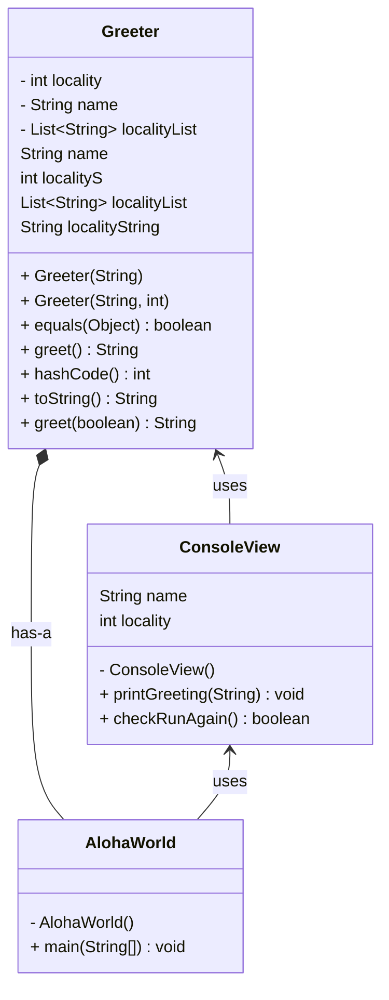

# Homework Aloha World Report

The following report contains questions you need to answer as part of your submission for the homework assignment. 

## Design Doc
Please link your UML design file here. See resources in the assignment on how to
link an image in markdown. You may also use [mermaid] class diagrams if you prefer, if so, include the mermaid code here.  You DO NOT have to include Greeting.java as part of the diagram, just the AlohaWorld application that includes: [AlohaWorld.java], [Greeter.java], and [ConsoleView.java].

------

### Program Flow
Write a short paragraph detailing the flow of the program in your own words. This is to help you understand / trace the code (and give you practice of something called a code walk that will be required in this course).

------The program begins execution in the main() method of the AlohaWorld class. Within this method, the program first prompts the client to enter their name and location using the static methods of the ConsoleView class, which handles user input and output. Once the client's input is collected, an instance of the Greeter class is created using the provided name and location. The Greeter object is responsible for generating a personalized greeting message based on the input. The program then retrieves this greeting by calling the greet() method of the Greeter class. Finally, the generated greeting is displayed back to the client using the static displayMessage() method from the ConsoleView class. The flow ensures a clear and interactive user experience, guiding the client through a series of inputs and providing an output based on their responses.

## Assignment Questions

1. List three additional java syntax items you didn't know when reading the code.  (make sure to use * for the list items, see example below, the backtick marks are used to write code inline with markdown)
   
   * (example) `final class`
   * this()
   * String.format()
   * Scanner SCANNER = new Scanner(System.in)
   

2. For each syntax additional item listed above, explain what it does in your own words and then link a resource where you figured out what it does in the references section. 

    * (example) The `final` keyword when used on a class prevents the class from being subclassed. This means that the class cannot be extended by another class. This is useful when you want to prevent a class from being modified or extended[^1] . It is often the standard to do this when a class only contains static methods such as driver or utility classes. Math in Java is an example of a final class[^2] .
    * The this() keyword is used to call another constructor within the same class. It helps reduce redundancy when initializing objects with multiple constructor variations[^3].
    * The String.format() method allows formatted string creation, similar to printf. It replaces placeholders (%s, %d, etc.) with actual values[^4].
    * The Scanner class is used to take user input. new Scanner(System.in) creates a scanner object that reads input from the console[^5].

3. What does `main` do in Java? 
   
   The main method is the entry point of a Java program, where execution begins.

4. What does `toString()` do in Java? Why should any object class you create have a `toString()` method?

   The toString() method in Java returns a string representation of the object. Overriding toString() in custom classes makes it easier to print and debug objects by providing meaningful output instead of the default memory address.

5. What is javadoc style commenting? What is it used for? 

   Javadoc-style commenting uses /** ... */ to document Java classes, methods, and fields. It is used to generate HTML documentation, providing descriptions, parameter details, and return values. This helps developers maintain and use code efficiently.

6. Describe Test Driving Development (TDD) in your own words. 

   TDD is 6. Describe Test Driving Development (TDD) in your own words.

7. Go to the [Markdown Playground](MarkdownPlayground.md) and add at least 3 different markdown elements you learned about by reading the markdown resources listed in the document. Additionally you need to add a mermaid class diagram (of your choice does not have to follow the assignment. However, if you did use mermaid for the assignment, you can just copy that there). Add the elements into the markdown file, so that the formatting changes are reserved to that file. 

   See markdown playground

## Deeper Thinking Questions

These questions require deeper thinking of the topic. We don't expect 100% correct answers, but we encourage you to think deeply and come up with a reasonable answer. 

1. Why would we want to keep interaction with the client contained to ConsoleView?
   
   Because it can make the concerns separated. It makes the console interactions isolated from business logic. So that the code is more maintainable, as it wont affect the other logic. 

2. Right now, the application isn't very dynamic in that it can be difficult to add new languages and greetings without modifying the code every time. Just thinking programmatically,  how could you make the application more dynamic? You are free to reference Geeting.java and how that could be used in your design.

   Instead of hardcoding greetings, we could use an interface or abstract class (Greeting.java) and allow different greeting classes to implement it. A factory pattern could then instantiate the correct greeting based on user input.

> [!IMPORTANT]
>  After you upload the files to your github (ideally you have been committing throughout this progress / after you answer every question) - make sure to look at your completed assignment on github/in the browser! You can make sure images are showing up/formatting is correct, etc. The TAs will actually look at your assignment on github, so it is important that it is formatted correctly.

## References

[^1]: Final keyword in Java: 2024. https://www.geeksforgeeks.org/final-keyword-in-java/. Accessed: 2024-03-30. 

[^2]: Math (Java Platform SE 17). https://docs.oracle.com/en/java/javase/17/docs/api/java.base/java/lang/Math.html. Accessed: 2024-03-30.

[^3]: This keyword in Java: 2024. https://docs.oracle.com/javase/tutorial/java/javaOO/thiskey.html. Accessed: 2025-01-27.

[^4]: String.format keyword in Java: 2024. https://docs.oracle.com/javase/8/docs/api/java/lang/String.html#format-java.lang.String-java.lang.Object...-. Accessed: 2025-01-27.

[^5]: Scanner keyword in Java: 2024. https://docs.oracle.com/javase/8/docs/api/java/util/Scanner.html. Accessed: 2025-01-27.

<!-- This is a comment, below this link the links in the document are placed here to make ti easier to read. This is an optional style for markdown, and often as a student you will include the links inline. for example [mermaid](https://mermaid.js.org/intro/syntax-reference.html) -->
[mermaid]: https://mermaid.js.org/intro/syntax-reference.html
[AlohaWorld.java]: src/main/java/student/AlohaWorld.java
[Greeter.java]: src/main/java/student/Greeter.java
[ConsoleView.java]: src/main/java/student/ConsoleView.java